# Alien invasion
> Simulates aliens randomly attacking various regions

## Get Started


### 1. Prerequisites

* Install go [Official Go Website](https://go.dev/)
* Then clone this repository

```bash
// cloning repository
$ git clone git@github.com:vuegoman/aliens.git

// download dependencies
$ cd aliens
$ go mod tidy
```

### 2. Running the program

* Now it's ready to run the simulation

```
// run the command
$ go run main.go
```

* You get to choose the map. 
* choose a number between 0 - 4
* The maps are located in /map directory\
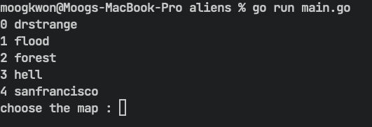

* Once you chose a map, type in the number of aliens you want to generate\
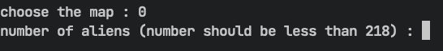

* The simulation has started and aliens randomly landed on empty spaces\
* 🌊 : wave (aliens can't cross rivers)
* 🌉 : bridge (aliens can cross bridges unless it's burned down by near fire)
* 🌲 : Tree (aliens can't cross and it turns into ashes if fire is within reach)
* 🔥 : Fire (aliens can't bypass fire)
* The bottom of the simulation displays the status of the current scenario (map, duration, alien status)\
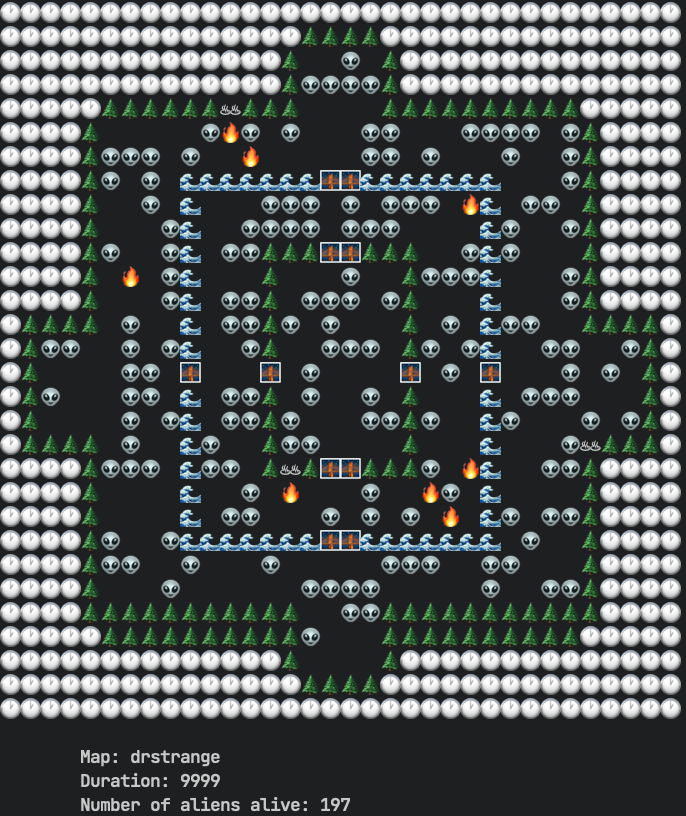

* While the simulation continues, the logs are stored in /history/logBook.txt* The logs indicate the pairs of combat aliens and the location of the destroyed region\
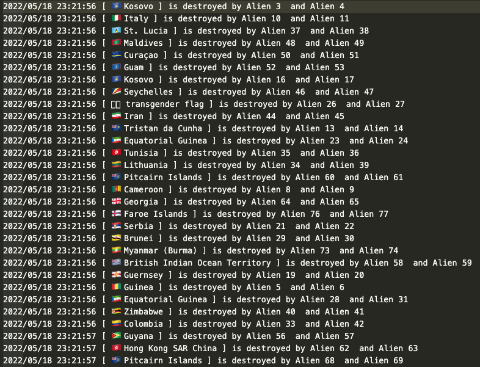

* When the simulation ends, the logs are displayed in terminal
* Press "ESC" to stop the simulation while it's running\
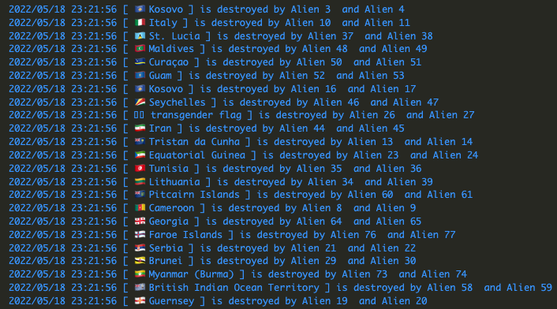

* When the region is destroyed after aliens clash it makes an ashes around bridges and trees
* Aliens cannot cross burnt trees or bridges
* This often traps and isolates the aliens from confronting other aliens\
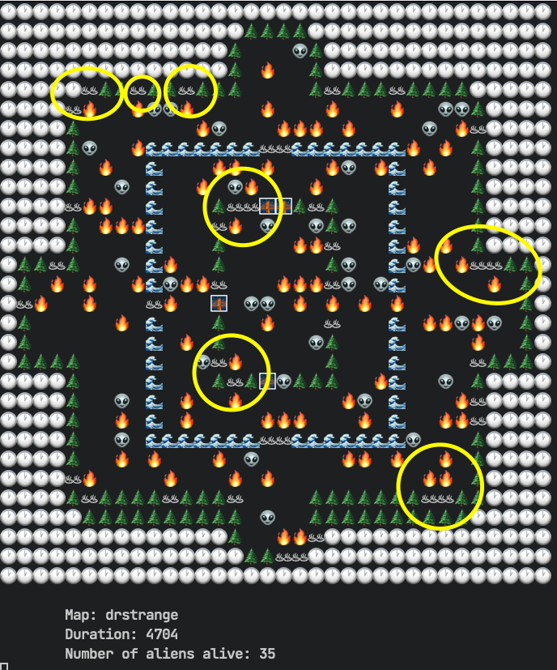

* the config file is located in configs/config.json
* You can update emojis, speed of the simulation, and turn on debug mode
* "duration" : updates the number of iteration
* "time" : updates the speed of simulation
* "debug_mode" : when it's true, it turns off the cbreak mode and runs vscode debugger\
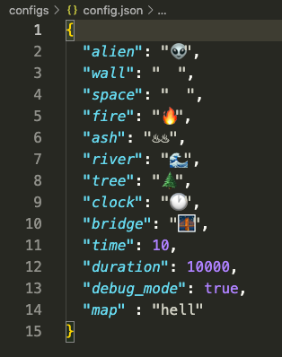


### 3. Maps
0. Dr. Strange\

1. Flood\
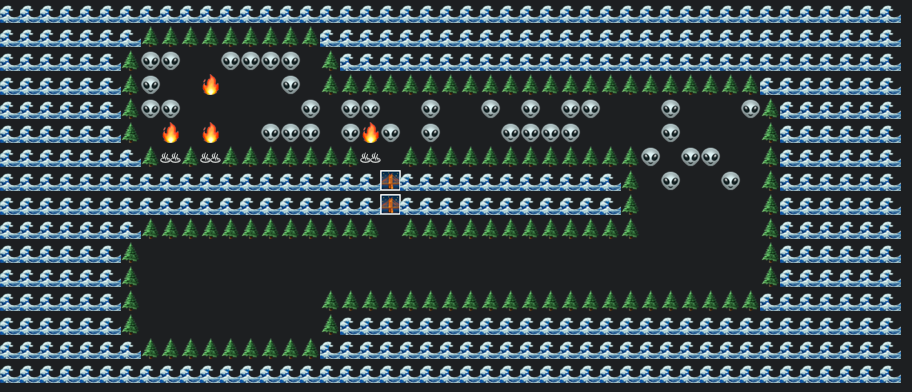
2. Forest\
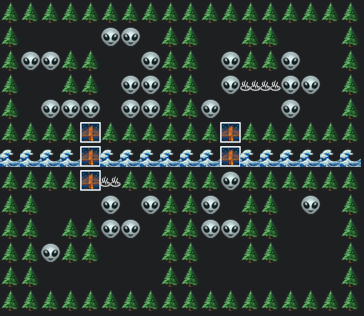
3. Hell\
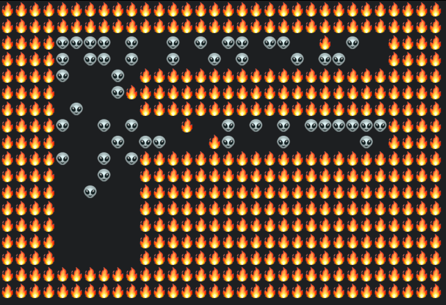
3. IGNITE\
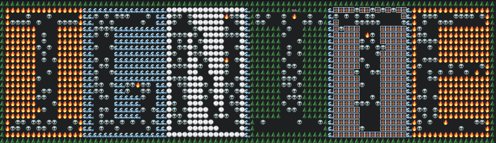
4. San Francisco\
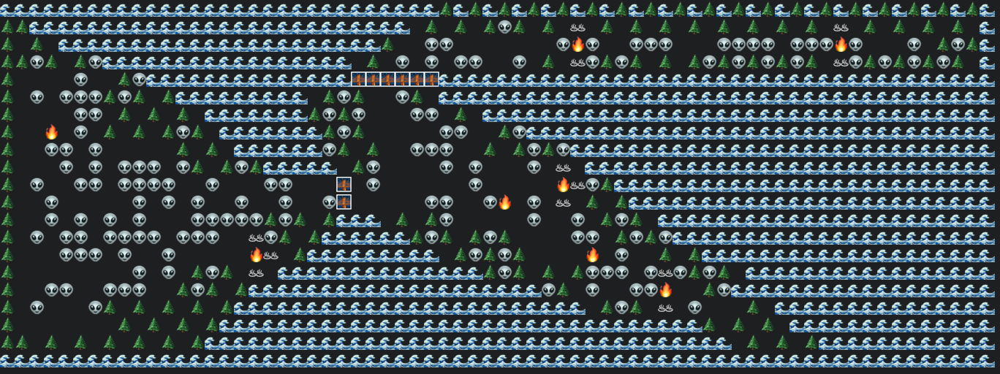
5. You can also make your own map in /map directory

> The game is written in single file, main.go